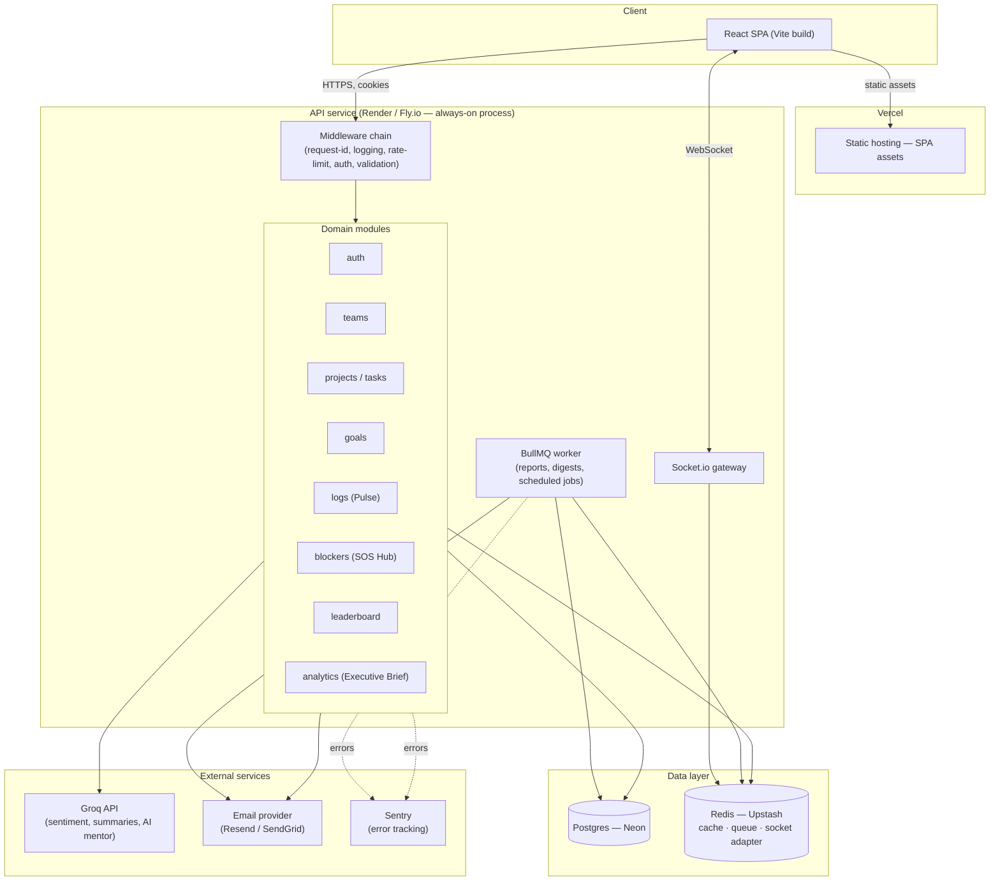
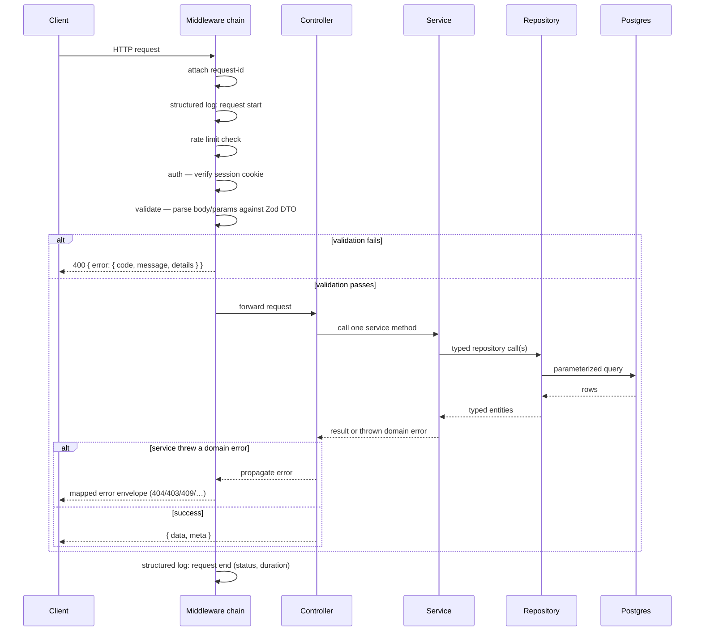
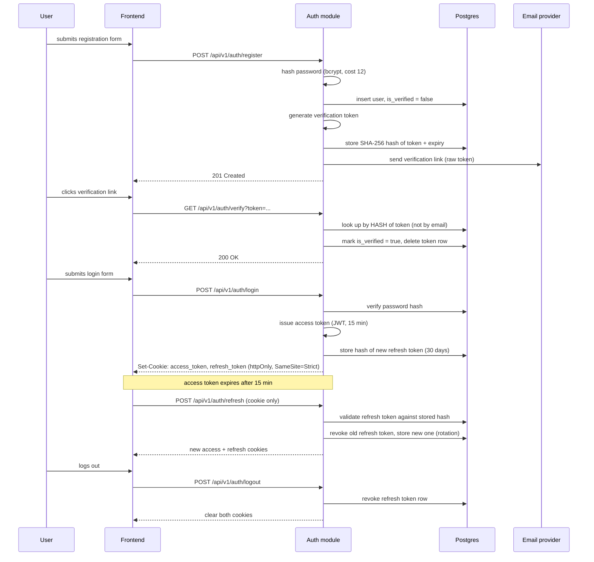
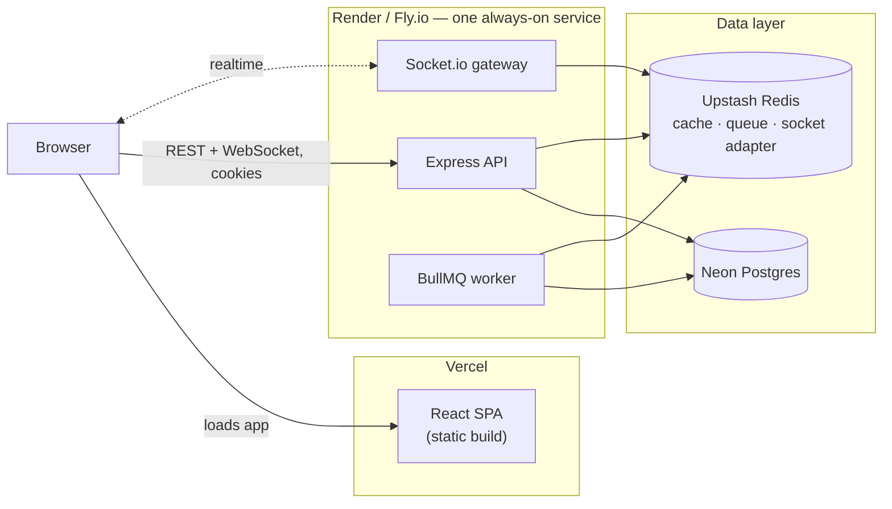

# CommandCenter — Architecture Reference

> **Status:** Target-state reference. This document describes the architecture CommandCenter is being rebuilt toward, as designed in [`ENTERPRISE_REBUILD_BLUEPRINT.md`](./architecture/ENTERPRISE_REBUILD_BLUEPRINT.md). No code has been changed to produce this document — it is the reference every milestone in that blueprint implements toward, and should be kept in sync as milestones land.

---

## Table of contents

1. [High-level architecture](#1-high-level-architecture)
2. [Request lifecycle](#2-request-lifecycle)
3. [Authentication flow](#3-authentication-flow)
4. [Database ER diagram](#4-database-er-diagram)
5. [Folder structure](#5-folder-structure)
6. [Module responsibilities](#6-module-responsibilities)
7. [API conventions](#7-api-conventions)
8. [Security model](#8-security-model)
9. [Deployment architecture](#9-deployment-architecture)
10. [Future scalability plan](#10-future-scalability-plan)

---

## 1. High-level architecture

CommandCenter is a **modular monolith**: one deployable Express/TypeScript service organized into independent domain modules, sitting behind a React SPA and in front of a single Postgres database. Redis and a background worker are used deliberately where a feature actually needs them (real-time presence, caching, scheduled/queued jobs) — not carried as unused dependencies.



**Why a monolith, not microservices:** at CommandCenter's current and near-term scale, splitting into services would add network calls, deployment surfaces, and operational overhead without a scaling problem that justifies it. Each module already owns its own controller/service/repository/DTO files and talks to other modules only through their service interfaces — the boundary that would make a future extraction possible, if a specific module (most plausibly `blockers`/realtime, or `analytics`/jobs) ever genuinely outgrows the rest.

---

## 2. Request lifecycle

Every HTTP request passes through the same ordered chain before reaching business logic, and the same chain in reverse on the way out.



Controllers never touch the database directly, and services never construct an HTTP response — each layer has exactly one job, which is what makes the chain above true for every route without exception, rather than a convention some routes forget to follow.

---

## 3. Authentication flow

Session state lives in httpOnly cookies, not `localStorage` — the frontend JavaScript never holds the token, which removes it as an XSS-exfiltration target. This trades in a CSRF consideration (addressed in [Section 8](#8-security-model)) that bearer-token auth didn't have.



---

## 4. Database ER diagram

The target schema closes the integrity gaps found in the pre-rebuild audit: a real `audit_logs` table, junction tables in place of JSONB pseudo-relations, a `refresh_tokens` table for the auth flow above, and `updated_at` tracked on every table.

```mermaid
erDiagram
    USERS ||--o{ TEAM_MEMBERS : "belongs to teams via"
    USERS ||--o{ TEAM_INVITES : "invited by"
    USERS ||--o{ JOIN_REQUESTS : "requests to join"
    USERS ||--o{ PROJECTS : "creates"
    USERS ||--o{ TASKS : "owns"
    USERS ||--o{ TASK_CONTRIBUTORS : "contributes to"
    USERS ||--o{ DAILY_LOGS : "writes"
    USERS ||--o{ BLOCKERS : "reports"
    USERS ||--o{ CHAT_MESSAGES : "sends"
    USERS ||--o{ USER_BADGES : "earns"
    USERS ||--o{ IMPACT_SCORE_HISTORY : "tracked in"
    USERS ||--o{ REFRESH_TOKENS : "holds"
    USERS ||--o{ AUDIT_LOGS : "acts as actor in"

    TEAMS ||--o{ TEAM_MEMBERS : "has members"
    TEAMS ||--o{ TEAM_INVITES : "issues"
    TEAMS ||--o{ JOIN_REQUESTS : "receives"
    TEAMS ||--o{ PROJECTS : "owns"
    TEAMS ||--o{ GOALS : "sets"
    TEAMS ||--o{ BLOCKERS : "logs"

    PROJECTS ||--o{ TASKS : "contains"

    TASKS ||--o{ TASK_CONTRIBUTORS : "has contributors"
    TASKS ||--o{ TASK_DEPENDENCIES : "depends on"
    TASKS ||--o{ BLOCKER_AFFECTED_TASKS : "affected by"

    GOALS ||--o{ GOALS : "parent of (self-referencing)"

    DAILY_LOGS ||--o{ LOG_EDIT_HISTORY : "revised in"

    BLOCKERS ||--o{ BLOCKER_AFFECTED_TASKS : "affects"
    BLOCKERS ||--o{ CHAT_MESSAGES : "discussed in"

    BADGES ||--o{ USER_BADGES : "awarded as"

    USERS {
        uuid user_id PK
        string name
        string email
        string password_hash
        boolean is_verified
        int streak_count
        int impact_score
        jsonb privacy_settings
        timestamp created_at
        timestamp updated_at
    }

    TEAMS {
        uuid team_id PK
        string name
        enum team_type
        uuid created_by FK
        timestamp created_at
        timestamp updated_at
    }

    TEAM_MEMBERS {
        uuid team_id FK
        uuid user_id FK
        enum role
        jsonb permissions
        timestamp joined_at
    }

    TEAM_INVITES {
        uuid invite_id PK
        uuid team_id FK
        string email
        uuid invited_by FK
        enum status
        timestamp expires_at
        timestamp created_at
    }

    JOIN_REQUESTS {
        uuid request_id PK
        uuid team_id FK
        uuid user_id FK
        enum status
        timestamp created_at
    }

    PROJECTS {
        uuid project_id PK
        uuid team_id FK
        string name
        string description
        enum status
        uuid created_by FK
        timestamp created_at
        timestamp updated_at
    }

    TASKS {
        uuid task_id PK
        uuid project_id FK
        string title
        uuid owner FK
        enum status
        enum priority
        date due_date
        timestamp created_at
        timestamp updated_at
    }

    TASK_CONTRIBUTORS {
        uuid task_id FK
        uuid user_id FK
    }

    TASK_DEPENDENCIES {
        uuid task_id FK
        uuid depends_on_task_id FK
    }

    GOALS {
        uuid goal_id PK
        uuid team_id FK
        uuid parent_goal_id FK
        string title
        enum goal_type
        enum status
        int progress
        timestamp created_at
        timestamp updated_at
    }

    DAILY_LOGS {
        uuid log_id PK
        uuid user_id FK
        text entry_text
        string sentiment
        text summary
        string signature
        date log_date
        boolean is_edited
        timestamp created_at
        timestamp updated_at
    }

    LOG_EDIT_HISTORY {
        uuid edit_id PK
        uuid log_id FK
        text previous_text
        timestamp edited_at
    }

    BLOCKERS {
        uuid blocker_id PK
        uuid team_id FK
        uuid reported_by FK
        string title
        enum blocker_type
        enum urgency
        enum impact
        enum severity
        enum status
        timestamp created_at
        timestamp updated_at
    }

    BLOCKER_AFFECTED_TASKS {
        uuid blocker_id FK
        uuid task_id FK
    }

    CHAT_MESSAGES {
        uuid message_id PK
        uuid blocker_id FK
        uuid user_id FK
        text message
        timestamp created_at
    }

    BADGES {
        uuid badge_id PK
        string name
        string description
        jsonb criteria
    }

    USER_BADGES {
        uuid user_id FK
        uuid badge_id FK
        timestamp earned_at
    }

    IMPACT_SCORE_HISTORY {
        uuid history_id PK
        uuid user_id FK
        int score
        timestamp recorded_at
    }

    REFRESH_TOKENS {
        uuid token_id PK
        uuid user_id FK
        string token_hash
        timestamp expires_at
        timestamp revoked_at
        timestamp created_at
    }

    AUDIT_LOGS {
        uuid audit_id PK
        uuid actor_id FK
        string action
        string resource_type
        uuid resource_id
        jsonb diff
        timestamp created_at
    }
```



---

## 5. Folder structure

```
backend/
├─ drizzle/                      # generated SQL migrations, version controlled
├─ src/
│  ├─ config/                    # env schema (zod), constants
│  ├─ common/
│  │  ├─ errors/                 # AppError + subclasses
│  │  ├─ middleware/             # auth, validate, rateLimit, requestId, errorHandler
│  │  ├─ logger/                 # pino instance + redaction rules
│  │  └─ utils/
│  ├─ db/
│  │  ├─ schema.ts                # Drizzle table definitions (source of truth)
│  │  └─ client.ts                # single pool, exported once
│  ├─ modules/
│  │  ├─ auth/         {controller, service, repository, dto, routes}.ts
│  │  ├─ users/         …
│  │  ├─ teams/         …
│  │  ├─ projects/      …
│  │  ├─ tasks/         …
│  │  ├─ goals/         …
│  │  ├─ blockers/      …
│  │  ├─ logs/          …          # "the Pulse"
│  │  ├─ leaderboard/   …
│  │  ├─ analytics/     …          # "Executive Brief"
│  │  ├─ ai/            {groqClient.ts, prompts.ts}
│  │  └─ notifications/ {emailService.ts, templates/}
│  ├─ jobs/                       # BullMQ queues + workers
│  ├─ realtime/                   # Socket.io gateway, room auth
│  ├─ app.ts                      # builds & exports the Express app (no listen())
│  └─ server.ts                   # entrypoint: imports app, calls listen()
├─ tests/
│  ├─ unit/            # mirrors src/modules/*
│  ├─ integration/     # Supertest against a real test DB
│  └─ e2e/             # Playwright, critical flows only
└─ package.json

frontend/
├─ src/
│  ├─ app/                        # router, providers, layout shell
│  ├─ components/ui/              # Button, Modal, Card, Input, Badge, Spinner…
│  ├─ features/
│  │  ├─ auth/          {api.ts, components/, types.ts}
│  │  ├─ pulse/         …
│  │  ├─ teams/         …
│  │  ├─ projects/      …
│  │  ├─ goals/         …
│  │  ├─ sos-hub/       …
│  │  ├─ leaderboard/  …
│  │  └─ analytics/     …
│  ├─ lib/                        # api client, query client, auth session
│  └─ styles/
└─ tests/
```

---

## 6. Module responsibilities

Every backend module follows the same five-file shape, so any engineer can navigate an unfamiliar module by convention alone:

| File | Owns |
|---|---|
| `*.routes.ts` | URL → controller wiring, plus the validation/auth middleware for each route |
| `*.controller.ts` | Parse request → call one service method → shape the response envelope. No business logic, no direct DB access. |
| `*.service.ts` | Business rules, cross-repository orchestration, domain errors |
| `*.repository.ts` | Typed Drizzle queries only, behind an interface. No SQL string-building from request bodies. |
| `*.dto.ts` | Zod request schemas + response-shaping types |

| Module | Responsibility |
|---|---|
| `auth` | Registration, verification, login, refresh-token rotation, logout, password hashing |
| `users` | User profile CRUD, privacy settings |
| `teams` | Team CRUD, membership, invites, join requests |
| `projects` | Project CRUD, team-scoped listing |
| `tasks` | Task CRUD, contributors, dependencies, status transitions |
| `goals` | Goal hierarchy (company → department → project → task), progress rollup |
| `blockers` | Blocker submission, AI-assisted analysis, escalation, chat (SOS Hub) |
| `logs` | Daily log ("Pulse") CRUD, streak tracking, AI sentiment/summary, integrity signing |
| `leaderboard` | Impact-score computation and ranking ("The Grid") |
| `analytics` | Team health metrics, weekly report generation ("Executive Brief") |
| `ai` *(support)* | Shared Groq client, prompt templates, timeout/circuit-breaker — no HTTP routes of its own |
| `notifications` *(support)* | Email sending, templates — no HTTP routes of its own |

A service may call another module's service (e.g., `logs` calling `leaderboard` after a streak milestone) but never another module's repository directly — the boundary that keeps modules independently testable and, later, independently extractable.

---

## 7. API conventions

- **Versioned and resource-based:** `/api/v1/teams/:teamId/projects`, not a flat, unversioned path.
- **One response envelope**, applied by a shared helper, not hand-rolled per controller:
  - Success: `{ "data": …, "meta": { "page": 1, "limit": 20, "total": 143 } }`
  - Failure: `{ "error": { "code": "NOT_FOUND", "message": "…", "details": […] } }`
- **Consistent status codes:** 400 validation, 401 unauthenticated, 403 forbidden, 404 not found, 409 conflict, 500 unhandled — codified in the centralized error-handling middleware, not left to per-controller judgment.
- **Actions with side effects are `POST`, not `GET`** — anything that triggers an AI call or a write is not modeled as an idempotent read.
- **Every list endpoint paginates** (`?page&limit`) — no endpoint returns an unbounded result set.
- **DTO-validated at the boundary:** every request body/params/query is parsed against a Zod schema before a controller runs; unknown keys are rejected, not silently ignored.

---

## 8. Security model

| Concern | Approach |
|---|---|
| **Password storage** | bcrypt, cost factor 12 |
| **Session** | Short-lived JWT access token (15 min) + rotating opaque refresh token (30 days), both httpOnly, `SameSite=Strict` cookies — never in `localStorage` |
| **CSRF** | Double-submit CSRF token required on every state-changing request, since cookie-based auth (unlike the old bearer-token scheme) is vulnerable to it |
| **Authorization** | Two composable middlewares: `requireRole([...])` for role checks, `requireTeamMembership()` for resource scoping — replacing all ad-hoc per-handler permission checks |
| **Mass-assignment** | Closed by two independent layers: DTOs reject unknown keys, and repositories expose named update methods rather than a generic key-value update |
| **Transport** | `helmet` security headers, CORS allowlist read from environment config (no open `cors()`) |
| **Rate limiting** | `express-rate-limit` globally, with a stricter bucket on `/auth/login` and `/auth/register` |
| **Secrets** | Held only in the hosting platform's environment-variable UI, never committed; app refuses to boot if a required variable is missing (no silent fallback to a hardcoded default) |
| **Log integrity** | HMAC-SHA256 with a server-held secret for signed daily logs (replacing an unkeyed hash), or the feature is explicitly deprioritized — a product decision, not a silent gap |
| **Data deletion** | Soft-delete with an audit-logged grace period before any hard delete, for GDPR-style user data removal |
| **Observability of failure** | Every error the centralized handler catches is logged with request context and reported to Sentry — nothing fails silently |

---

## 9. Deployment architecture



The frontend stays on Vercel — a static build is exactly what it's good at. The API, Socket.io gateway, and background worker are one deployable on a platform that keeps a process running between requests (Render or Fly.io free/hobby tier), because persistent WebSocket connections, a queue worker loop, and a warm connection pool all require that — a requirement serverless functions structurally can't meet. A staging environment (separate Neon branch database, separate Render/Fly service) sits ahead of production, with production deploys gated by manual approval.

---

## 10. Future scalability plan

The architecture above is sized for the next stage of growth, not the current prototype scale — the plan below is what changes as real usage grows, in the order it's likely to matter.

1. **Cache before you scale compute.** Leaderboard and analytics reads move to Redis-backed caching with scheduled recomputation (already planned in the blueprint) before any horizontal scaling of the API is needed — most early load is repeated reads, not write volume.
2. **Horizontal API scaling.** Because the API is stateless (session state lives in the DB/Redis, not in-process), running multiple API instances behind a load balancer is a platform config change, not an architecture change — Render and Fly both support this natively. Socket.io requires the Redis adapter (already in the target architecture) specifically so multiple instances can share realtime state.
3. **Read replicas.** Neon supports read replicas; analytics/reporting queries (Executive Brief) are the first candidate to move off the primary, since they're read-heavy and latency-tolerant compared to the write path (logs, tasks).
4. **Background work stays off the request path.** Report generation, digest emails, and impact-score recalculation are already queued (BullMQ) rather than synchronous — the next step under real load is multiple worker instances consuming the same queue, not architectural change.
5. **Module extraction, if and when justified.** The `blockers` (realtime chat) and `analytics` (heavy aggregation) modules are the most plausible candidates to split into their own deployable services if they ever develop load or release-cadence needs distinct from the rest of the monolith. The module boundary (service-to-service calls only, never cross-module repository access) is what makes this possible without a rewrite — but it is deliberately not done until a real need appears.
6. **Multi-team and multi-region are data-model-ready, not infrastructure-ready.** The schema already supports many teams per user and many users per team; a future multi-region deployment would be a hosting/CDN decision layered on top of the existing design, not a schema change.
7. **Database growth.** Partitioning `daily_logs` and `audit_logs` by date range is the first table-level scaling step once row counts justify it — both are naturally time-ordered, append-heavy tables, the standard case for range partitioning.

None of the above is built ahead of need. The point of listing it here is that the module boundaries, statelessness, and queue-based background work chosen in Sections 1–9 are exactly what keeps each of these a config or infrastructure change later, rather than a rewrite.

---

*Reference document only — no code was changed to produce this document. Keep it in sync with [`ENTERPRISE_REBUILD_BLUEPRINT.md`](./architecture/ENTERPRISE_REBUILD_BLUEPRINT.md) as milestones land; where the two ever disagree, the blueprint's milestone history is the record of what actually happened, and this file should be updated to match reality.*
