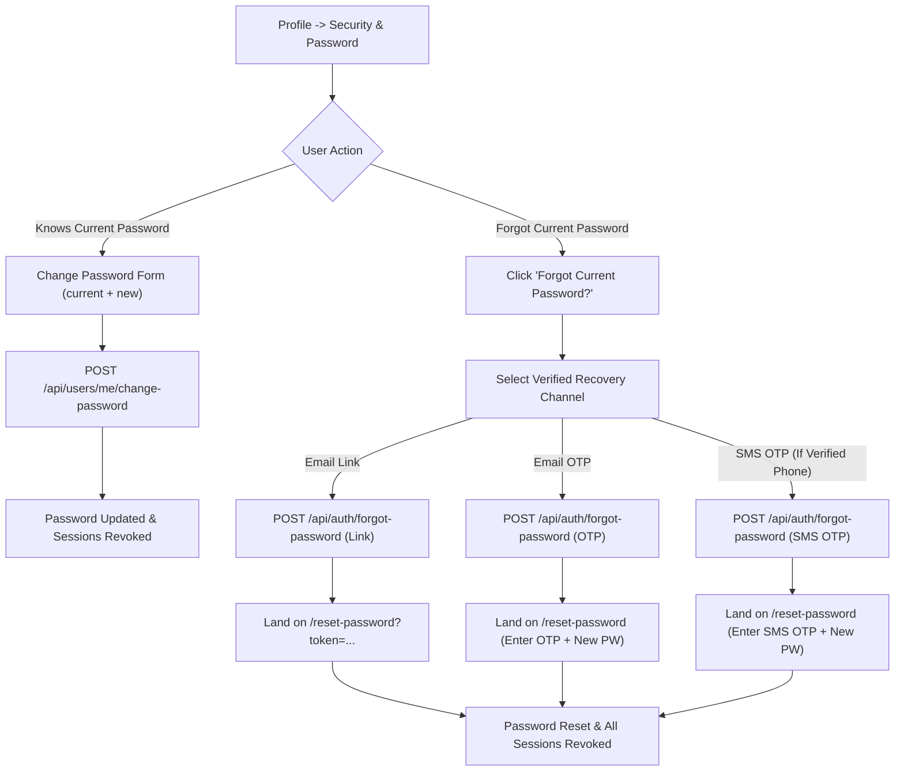
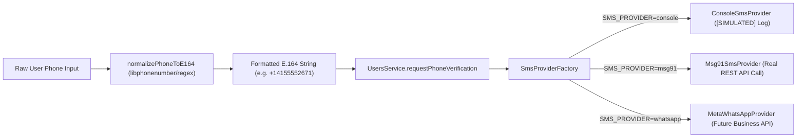
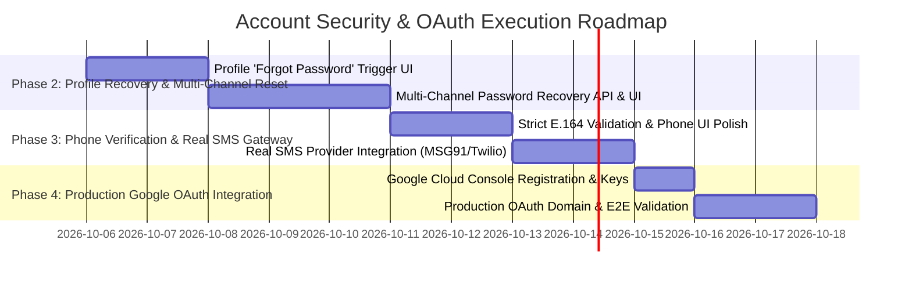

# Account Security, Phone Verification & Google OAuth Implementation Delta

## Executive Summary

This document specifies the comprehensive architecture, current implementation status, threat analysis, and deployment readiness plan for CommandCenter's **Account Security (Profile Management & Recovery), Phone OTP Verification, and Google OAuth 2.0 / OIDC** integrations.

> [!IMPORTANT]
> **STATUS: IMPLEMENTED & VERIFIED LOCALLY**
> Account Security (change password with session revocation, change email with dual verification, forgot/reset password via link and OTP), Google OAuth 2.0 PKCE, and Phone OTP verification with console simulation (`ConsoleSmsProvider`, real SMS deferred due to India DLT prerequisites & vendor costs) are fully implemented and verified locally (168/168 tests passed across 8 core suites, TypeScript check passed, frontend build passed).

---

## 1. Verified Current Implementation Status

Following empirical codebase inspection across backend services, repositories, controllers, database schema, and React frontend components:

### A. Profile Contact & Verification
1. **Change Email (`POST /api/users/me/request-email-change` & `POST /api/auth/verify-email-change`):**
   - **Status:** **Fully Implemented.**
   - **Behavior:** Requires current password confirmation first. Stores `pending_email` and `email_change_token_hash`. Sends branded verification email to `new_email`. Upon link consumption, swaps email, sets `email_changed_at`, and revokes all refresh tokens. If email send fails, pending state automatically rolls back to `null`.
2. **Phone Number Storage & Verification (`POST /api/users/me/request-phone-verification` & `POST /api/users/me/verify-phone`):**
   - **Status:** **Partially Implemented (Simulated SMS Provider).**
   - **Behavior:** E.164 normalization (`normalizePhoneToE164`), 6-digit numeric OTP generation (`generatePhoneOtp`), 10-min TTL, 5-attempt limit, 60s resend cooldown.
   - **SMS Delivery Investigation:** Uses `ConsoleSmsProvider` by default (`SMS_PROVIDER=console`), which outputs `[SIMULATED] SMS OTP sent (console provider - no real SMS sent)` to application logs. No external SMS costs or third-party APIs are invoked during local development or testing.

### B. Security & Password Management
1. **Change Password (`POST /api/users/me/change-password`):**
   - **Status:** **Fully Implemented.**
   - **Behavior:** Requires `current_password`, validates that `new_password` differs from current, hashes with bcrypt (`SALT_ROUNDS=12`), updates `password_hash` and `password_changed_at`, and revokes all active refresh tokens for the account (`authRepository.resetPasswordAndRevokeSessions`).
2. **Forgot Password (`POST /api/auth/forgot-password` & `POST /api/auth/reset-password`):**
   - **Status:** **Implemented for Email Link.**
   - **Behavior:** Generates opaque reset token, hashes with SHA-256 (`password_reset_token_hash`), 1-hr TTL, dispatches branded email via `SmtpEmailProvider` / Gmail SMTP. `resetPassword` updates password, clears reset token fields, and revokes all active refresh tokens. Returns anti-enumeration generic responses.

### C. Google & Microsoft OAuth 2.0 / OIDC
1. **OAuth Foundation (`oauth.service.ts` & `oauthController.ts`):**
   - **Status:** **Fully Implemented in Code — Awaiting Production Credential Verification.**
   - **Security Controls:** PKCE (`code_verifier` / `code_challenge`), HMAC-SHA256 signed `stateToken` cookie (`oauth_state`), nonce validation, ID token verification using `google-auth-library` and `jwks-rsa`.
   - **Account Linking:** Automatically links Google ID to an existing account if `is_verified = true` or if Google OIDC verifies the email address.
   - **Frontend UI:** `Login.tsx` and `Register.tsx` render visible **Google** and **Microsoft** sign-in buttons connected to `loginWithOAuth(provider)`. `OAuthCallback.tsx` processes code exchange and sets session cookies.

---

## 2. Component & File Mapping Matrix

| Feature | Frontend File | Backend Route / Controller | Backend Service / Repository | Database Fields |
| :--- | :--- | :--- | :--- | :--- |
| **Change Password** | `Profile.tsx` | `POST /api/users/me/change-password` | `users.service.ts` -> `changePassword` | `users.password_hash`, `users.password_changed_at` |
| **Email Change** | `Profile.tsx` | `POST /api/users/me/request-email-change` | `users.service.ts` -> `requestEmailChange` | `users.pending_email`, `users.email_change_token_hash` |
| **Phone OTP Request** | `Profile.tsx` | `POST /api/users/me/request-phone-verification` | `users.service.ts` -> `requestPhoneVerification` | `users.phone_number`, `users.phone_otp_hash`, `users.phone_otp_expires` |
| **Phone OTP Verify** | `Profile.tsx` | `POST /api/users/me/verify-phone` | `users.service.ts` -> `verifyPhone` | `users.phone_verified`, `users.phone_otp_attempts` |
| **Forgot Password** | `ForgotPassword.tsx` | `POST /api/auth/forgot-password` | `auth.service.ts` -> `forgotPassword` | `users.password_reset_token_hash`, `users.password_reset_expires` |
| **Reset Password** | `ResetPassword.tsx` | `POST /api/auth/reset-password` | `auth.service.ts` -> `resetPassword` | `users.password_hash`, `refresh_tokens.revoked_at` |
| **Google OAuth** | `Login.tsx`, `OAuthCallback.tsx` | `GET /api/auth/oauth/google/init`, `GET /api/auth/oauth/google/callback` | `oauth.service.ts` -> `handleOAuthCallback` | `users.google_id`, `users.auth_provider`, `users.is_verified` |

---

## 3. Missing & Partially Implemented Capabilities

1. **Profile Password Recovery Option:**
   - *Current Gap:* `Profile.tsx` currently only supports changing password when the user knows their `current_password`. If a logged-in user forgot their current password, there is no direct "Forgot password?" recovery trigger within the Profile Security UI.
2. **Multi-Channel Password Recovery:**
   - *Current Gap:* `ForgotPassword.tsx` currently triggers an Email Link reset. It does not offer the option to request an **Email OTP** or **SMS OTP** for password recovery.
3. **Real SMS Provider Integration:**
   - *Current Gap:* `SMS_PROVIDER` defaults to `console`. Real SMS delivery requires configuring `SMS_PROVIDER=msg91` (or Twilio/Meta) with valid vendor API keys (`MSG91_API_KEY`, `MSG91_SENDER_ID`, `MSG91_DLT_TEMPLATE_ID`).

---

## 4. Proposed Profile & Recovery UX



---

## 5. Phone Verification Architecture (E.164 & Provider Abstraction)



### Technical Controls
1. **E.164 Standard:** Formats inputs into `+[country_code][number]` prior to OTP hashing or dispatch.
2. **Decoupled Verification State:** `phone_verified` is distinct from `is_verified` (email). Updating phone number resets `phone_verified = false` without invalidating email verification.
3. **Attempt & Lockout Limits:** 5 incorrect OTP entries clear `phone_otp_hash` and enforce a new OTP request (`PHONE_OTP_TOO_MANY_ATTEMPTS_MESSAGE`).

---

## 6. Google OAuth Completion & Deployment Checklist

### Production Setup Requirements

- [ ] **1. Google Cloud Console Configuration:**
  - Create a project in [Google Cloud Console](https://console.cloud.google.com).
  - Configure **OAuth consent screen** (User Type: External, Scopes: `openid`, `email`, `profile`).
  - Create **OAuth 2.0 Client ID** (Application type: Web application).
  - Add Authorized JavaScript origins:
    - Local: `http://localhost:3000`
    - Production: `https://your-production-domain.com`
  - Add Authorized redirect URIs:
    - Local: `http://localhost:3000/oauth/callback/google` (or backend callback `http://localhost:3001/api/auth/oauth/google/callback`)
    - Production: `https://your-production-domain.com/oauth/callback/google`

- [ ] **2. Environment Variables (`backend/.env`):**
  ```env
  GOOGLE_CLIENT_ID=your_google_client_id.apps.googleusercontent.com
  GOOGLE_CLIENT_SECRET=your_google_client_secret
  GOOGLE_REDIRECT_URI=http://localhost:3000/oauth/callback/google
  ```

- [ ] **3. End-to-End Manual Browser Testing:**
  - Click **Google** on `/login` -> Redirects to Google authentication screen.
  - Authenticate with a Google Account -> Redirects back to `/oauth/callback/google?code=...&state=...`.
  - Backend exchanges code for tokens, validates OIDC ID Token signature/claims, creates/links user, sets `refreshToken` HTTP-only cookie, and logs in user to `/pulse`.

---

## 7. Security & Risk Analysis

| Domain | Risk | Mitigation in Architecture |
| :--- | :--- | :--- |
| **Account Takeover via Email Change** | High | `requestEmailChange` requires `current_password` confirmation FIRST, sends link to NEW email address, and revokes all refresh tokens upon verification. |
| **Session Survival After Password Reset** | High | `resetPasswordAndRevokeSessions` executes password update and refresh token revocation (`revoked_at = NOW()`) inside a single atomic database transaction. |
| **OAuth State Tampering & CSRF** | Medium | State tokens are signed with HMAC-SHA256 (`crypto.createHmac('sha256', env.jwtSecret)`), stored in HTTP-only `oauth_state` cookie, and verified with `crypto.timingSafeEqual`. |
| **Phone OTP Brute Force** | Medium | `phone_otp_attempts` is tracked in PostgreSQL. 5 failed attempts clear `phone_otp_hash` completely. |

---

## 8. Implementation Roadmap



---

## 9. Product Decision Items for Approval

1. **Profile Password Recovery Trigger:**
   - Should a logged-in user clicking "Forgot Password?" inside Profile be allowed to receive a recovery OTP directly to their verified email/phone without leaving the Profile page?
2. **Real SMS Provider Selection:**
   - When real SMS delivery is enabled, should CommandCenter use MSG91 (ideal for India/DLT templates) or Twilio (global standard)?
3. **Google OAuth Production Client Credentials:**
   - Are the Google Cloud Console credentials ready for staging environment deployment?

---

> [!NOTE]
> **STATUS DECLARATION:** All feature changes described herein are implemented and verified locally. Real SMS delivery remains in console simulation (`ConsoleSmsProvider`) pending vendor activation and India DLT registration. Production deployment and production database migrations remain pending.
